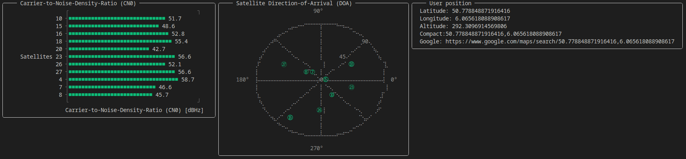

# GNSSReceiver (WIP)



## Installation

```julia
julia> ]
pkg> add GNSSReceiver
```

## Usage

### Example to read from file

```julia
using GNSSSignals, Tracking, GNSSReceiver, Unitful
using Unitful:Hz, ms
gpsl1 = GPSL1()
files = map(i -> "antenna$i.dat", 1:4) # Could also be a single file for a single antenna channel
sampling_freq = 5e6Hz
# The number of samples must be integer multiples of 1ms.
# The number of samples determines the length of the signal that
# is passed to the acquisition of the satellites.
# Higher values result into higher chance of acquisition, but also
# demand a larger computing power.
num_samples = Int(upreferred(sampling_freq * 4ms))
measurement_channel = read_files(files, num_samples, type = Complex{Int16})
# Let's receive GPS L1 signals
data_channel = receive(measurement_channel, gpsl1, sampling_freq; num_ants = NumAnts(4), num_samples)
# Get gui channel from data channel
gui_channel = get_gui_data_channel(data_channel)
# Hook up GUI
GNSSReceiver.gui(gui_channel)
# If you'd like to save the data as well, you will have to split the data channel:
# data_channel1, data_channel2 = tee(data_channel)
# data_task = @async save_data(data_channel1)
# gui_channel = get_gui_data_channel(data_channel2)
# GNSSReceiver.gui(gui_channel)
# data = fetch(data_task)
```

That's it. You can watch the GUI being updated in real time.

### Example to read from SDR

```julia
# Replace SoapyLMS7_jll with whatever SoapySDR driver that you need, e.g. SoapyRTLSDR_jll
using SoapyLMS7_jll
using GNSSReceiver, GNSSSignals, Unitful
using Tracking

# You'll might want to run it twice for optimal performance.
gnss_receiver_gui(;
    system = GPSL1(),
    sampling_freq = 2e6u"Hz",
    acquisition_time = 4u"ms", # A longer time increases the SNR for satellite acquisition, but also increases the computational load. Must be longer than 1ms
    run_time = 40u"s",
    num_ants = Tracking.NumAnts(2) # Number of antenna channels
)
```

