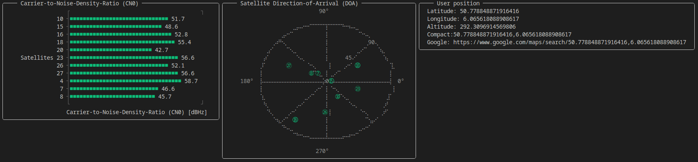

# GNSSReceiver (WIP)

[](https://JuliaGNSS.github.io/GNSSReceiver.jl/stable)
[](https://JuliaGNSS.github.io/GNSSReceiver.jl/dev)

A software-defined GNSS receiver in pure Julia: it acquires, tracks, decodes and computes
a position/velocity/time (PVT) solution from GNSS signal samples — streamed live from a
SoapySDR device or replayed from a file.

📖 **[Read the documentation](https://JuliaGNSS.github.io/GNSSReceiver.jl/dev)** for a
guided introduction, the full list of acquisition/tracking parameters, and a worked
example that computes a real position fix from a public recording.



## Installation

```julia
julia> ]
pkg> add GNSSReceiver
```

## Usage

See the **[documentation](https://JuliaGNSS.github.io/GNSSReceiver.jl/dev)** for usage —
all examples there are run automatically when the docs are built, so they stay in sync
with the code:

- [Getting Started](https://JuliaGNSS.github.io/GNSSReceiver.jl/dev/getting_started/) —
  receive live from an SDR or replay from a file.
- [Acquisition & Tracking Parameters](https://JuliaGNSS.github.io/GNSSReceiver.jl/dev/parameters/)
  — every knob you can set (coherent integration length, lock thresholds, …).
- [Worked Example (Real Data)](https://JuliaGNSS.github.io/GNSSReceiver.jl/dev/example/) —
  a complete position fix computed from a public recording.
- [Custom Receiver Output](https://JuliaGNSS.github.io/GNSSReceiver.jl/dev/custom_output/)
  — emit your own per-chunk data.
- [Graphical User Interface](https://JuliaGNSS.github.io/GNSSReceiver.jl/dev/gui/) — the
  live terminal GUI.
