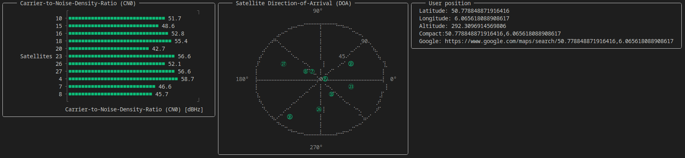

# Graphical User Interface

GNSSReceiver.jl ships a live, interactive **terminal dashboard** (built on
[Tachikoma.jl](https://github.com/kahliburke/Tachikoma.jl)) that updates as the receiver
processes samples. It lays out four panels:

- **Carrier-to-Noise-Density Ratio (CN0)** — a bar per tracked satellite (labelled with
  the RINEX-style satellite id and band, e.g. `G05 L1`), coloured green when the satellite
  is healthy and red otherwise.
- **Satellite Direction-of-Arrival** — a sky plot of the satellites in view, each drawn at
  its azimuth/elevation and labelled with its PRN, coloured by constellation (green GPS,
  blue Galileo, red GLONASS, yellow BeiDou), with a legend below.
- **Position Velocity Time (PVT)** — the fix as time (UTC), coordinates, altitude, ground
  speed and heading, followed by the solution diagnostics (the full DOP breakdown —
  GDOP/PDOP/HDOP/VDOP/TDOP — inter-system and inter-frequency biases, and pseudorange-residual
  RMS). Diagnostics are shown by default; press `d` to hide them.
- **Location** — the fix's coordinates and a clickable Google Maps link (an OSC 8 terminal
  hyperlink, so it opens on click in supporting terminals and is copy-pasteable elsewhere).
  A rendered in-terminal map view is coming as a follow-up.



## Keys

| Key | Action |
|-----|--------|
| `q` / `Ctrl-C` | quit |
| `d` | toggle the PVT diagnostics |

## Launching the GUI

### Live from an SDR

The simplest path is [`gnss_receiver_gui`](@ref), which opens the device, runs the
pipeline and blocks on the GUI until the run finishes:

```julia
using SoapyRTLSDR_jll
using GNSSReceiver, GNSSSignals, Tracking, SoapySDR, Unitful

gnss_receiver_gui(;
    system = GPSL1CA(),
    sampling_freq = 2e6u"Hz",
    chunk_time = 4u"ms",
    run_time = 40u"s",
    num_ants = Tracking.NumAnts(1),
    dev_args = first(Devices()),
)
```

### From a data channel

If you already have a data channel from [`receive`](@ref) (replaying a file, say), wrap it
with [`get_gui_data_channel`](@ref) and pass the result to `gui`. `get_gui_data_channel`
down-samples the per-chunk stream to a human refresh rate:

```julia
using GNSSReceiver, GNSSSignals, Unitful

measurement_channel = read_uint8_iq_file(
    "RTLSDR_Bands-L1.uint8",
    Int(upreferred(2.048e6u"Hz" * 4u"ms"));
    center = 127.5,
    type = ComplexF32,
    sample_rate = 2.048e6u"Hz",    # replay in real time so the dashboard is watchable
)
data_channel = receive(
    measurement_channel, GPSL1CA(), 2.048e6u"Hz";
    pvt_approximate_year = 2017,   # this recording is from 2017 (GPS week rollover)
)

GNSSReceiver.gui(get_gui_data_channel(data_channel))   # press `q` to quit
```

For a complete, copy-pasteable walkthrough — downloading a public recording and replaying
it into the dashboard — see the [Worked Example (Real Data)](@ref) page.

## Showing the GUI *and* saving the data

The GUI is just one consumer of the data channel. To display it **and** persist the run,
split the channel with `tee` and give each branch its own consumer:

```julia
using SignalChannels: tee

data_channel1, data_channel2 = tee(data_channel)
data_task = save_data(data_channel1; filename = "run.jld2")

gui_channel = get_gui_data_channel(data_channel2)
GNSSReceiver.gui(gui_channel)

wait(data_task)   # `save_data` returns its writer task; wait until the file is on disk
```

## Refresh rate

`gui` accepts an `fps` keyword (default `12`) that sets the dashboard's redraw rate; the
underlying `GUIData` stream is already down-sampled to a human refresh rate by
[`get_gui_data_channel`](@ref). For the smoothest display, start Julia with an interactive
thread (`julia -t auto,1`) — `gui` runs its render loop on the interactive threadpool when
one is available, so it is never starved by the streaming/DSP work. See the docstrings for
[`get_gui_data_channel`](@ref) and [`gui`](@ref GNSSReceiver.gui) in the
[API Reference](@ref).
